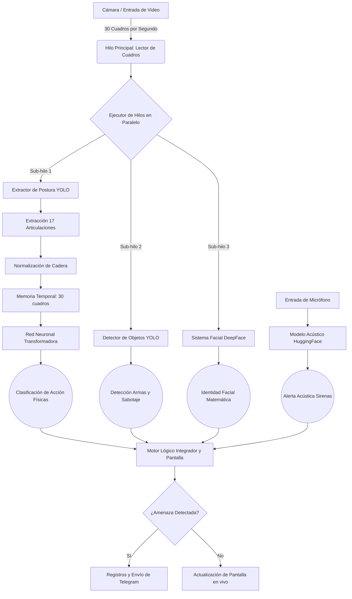

# Sistema Integral de Videovigilancia Autónoma
## Inteligencia Artificial Proactiva basada en Redes Neuronales Transformadoras

---

## 1. Introducción y Problemática
**Teoría:** Los sistemas tradicionales de videovigilancia son pasivos y dependen de un operador humano, quien sufre de fatiga visual a los pocos minutos. Los algoritmos clásicos de "detección de píxeles en movimiento" disparan miles de falsas alarmas (perros, sombras, lluvia).

**Solución:** Este proyecto es un **Centro de Mando Biométrico**. Extrae la topología matemática de las personas (huesos y articulaciones) y utiliza un Modelo Transformador (la misma arquitectura matemática subyacente que las inteligencias artificiales conversacionales modernas) para procesar secuencias de tiempo. Así logra diferenciar un comportamiento criminal de una actividad cotidiana normal de forma completamente autónoma.

---

## 2. Fuentes de Datos y Recursos Externos
Este sistema se construyó integrando los siguientes ecosistemas de vanguardia de código abierto:
1. **Ultralytics YOLO versión 8 (Visión y Postura)** - [https://github.com/ultralytics/ultralytics](https://github.com/ultralytics/ultralytics) (Extracción de esqueletos y armas).
2. **DeepFace (Biometría Facial)** - [https://github.com/serengil/deepface](https://github.com/serengil/deepface) (Modelo VGG-Face y RetinaFace).
3. **PyTorch (Motor Neuronal)** - [https://pytorch.org/](https://pytorch.org/) (Construcción del Modelo Transformador).
4. **HuggingFace AST (Audio)** - [MIT/ast-finetuned-audioset](https://huggingface.co/MIT/ast-finetuned-audioset-10-10-0.4593) (Análisis de espectrogramas acústicos).
5. **Conjunto de Datos COCO** - [https://cocodataset.org/](https://cocodataset.org/) (Diccionario estándar mundial para detección de objetos).

---

## 3. Guía de Instalación Rápida
```bash
git clone https://github.com/Sant-Os/visonia.git
cd visonia
pip install torch torchvision ultralytics opencv-python pandas numpy
pip install deepface tf-keras sounddevice transformers pyaudio
```

---

## 4. Arquitectura del Sistema (Ejecución en Paralelo)

Para evitar que el video se congele, el programa no procesa la inteligencia artificial de manera lineal. Utiliza un ejecutor de hilos paralelos. Mientras el hilo principal dibuja la pantalla a 30 cuadros por segundo, envía el video a tres "sub-hilos" que analizan amenazas por detrás.



---

## 5. Desglose Teórico y Técnico (Módulo por Módulo)

### 5.1. Extracción Biomecánica y Normalización Espacial
**La Teoría:** 
¿De dónde salen las 34 coordenadas? El extractor encuentra el esqueleto humano en **17 articulaciones clave** (Ojos, Nariz, Codos, Rodillas, etc.). Como vivimos en un plano de video de dos dimensiones, cada punto tiene un valor de Eje `X` y un Eje `Y` (17 x 2 = 34).
Para que la red neuronal no se confunda si la persona está muy cerca a la cámara (se ve grande) o muy lejos (se ve pequeña), aplicamos la **Centralización Euclidiana de Cadera**. Anclamos la cadera humana a la coordenada `(0.0, 0.0)` restándole su valor a todo el resto del cuerpo. Así evaluamos puramente la "Postura".

**El Código (`pose_extractor.py`):**
```python
from ultralytics import YOLO
import numpy as np

class PoseExtractor:
    def __init__(self, model_name='yolov8n-pose.pt'):
        self.model = YOLO(model_name)
        
    def extract(self, frame):
        results = self.model.track(frame, persist=True, verbose=False)
        r = results[0]
        kpts_all = r.keypoints.xyn.cpu().numpy() # Extraer los 17 puntos en X,Y
        ids_all = r.boxes.id.cpu().numpy().astype(int) if r.boxes.id is not None else []
        
        people_data = {}
        for i, person_id in enumerate(ids_all):
            kpts = kpts_all[i]
            if len(kpts) == 17:
                # Localizar la Cadera (Puntos 11 y 12 del cuerpo humano)
                center_x = (kpts[11][0] + kpts[12][0]) / 2.0
                center_y = (kpts[11][1] + kpts[12][1]) / 2.0
                
                # Normalización: Desplazar a todo el cuerpo hacia el origen cartesiano
                normalized_kpts = kpts.copy()
                mask = (normalized_kpts[:, 0] > 0) | (normalized_kpts[:, 1] > 0)
                normalized_kpts[mask, 0] -= center_x
                normalized_kpts[mask, 1] -= center_y
                
                people_data[person_id] = {'landmarks': normalized_kpts}
        return people_data
```

---

### 5.2. Registro y Recolección de Datos Biométricos
**La Teoría:**
Una Inteligencia Artificial se entrena con datos. Con la tecla `[R]`, el usuario graba un comportamiento (por ejemplo, "Caída"). El sistema toma la matriz de postura `[17, 2]` y la "aplana" para convertirla en un vector unidimensional largo de 34 posiciones. Finalmente, pega el nombre de la acción al principio de la lista y lo inyecta como una fila nueva en un archivo de valores separados por comas (`dataset_poses.csv`).

**El Código (`collect_data.py`):**
```python
import pandas as pd

# (Mientras el estado es "GRABANDO" a 30 Cuadros por Segundo...)
if state == "RECORDING":
    people_landmarks = extractor.extract(frame) # Matriz de 17x2
    
    for p_id, info in people_landmarks.items():
        kpts = info['landmarks']
        
        # Aplanar la Matriz a una lista plana de 34 valores
        flat_kpts = kpts.flatten().tolist()
        
        # Insertar la Clase (Ej. 'accidente' o 'forcejeo') como primera columna
        row = [classes[current_class_idx]] + flat_kpts
        data_rows.append(row)

# Escribir en disco duro al terminar
columns = ['class'] + [f'coord_{i}' for i in range(34)]
new_df = pd.DataFrame(data_rows, columns=columns)
new_df.to_csv('dataset_poses.csv', mode='a', index=False)
```

---

### 5.3. El Cerebro Neuronal: Entrenamiento y Predicción Transformadora
**La Teoría:**
Con la tecla `[T]` iniciamos el entrenamiento del cerebro. Evaluar "violencia" viendo solo 1 fotograma es imposible. Por eso, el código agarra los datos y los agrupa en ventanas de tiempo de **30 cuadros consecutivos** (1 segundo de movimiento real). Una Capa Transformadora analiza cómo evoluciona la postura a través del tiempo, usando atención global para procesar todos los cuadros en paralelo. El optimizador usa **Retropropagación** del error (Pérdida de Entropía Cruzada) para ajustar el modelo a lo largo de 20 Ciclos de Entrenamiento.

**El Código (`action_classifier.py`):**
```python
import torch
import torch.nn as nn

class ActionTransformer(nn.Module):
    def __init__(self, input_dim=34, num_classes=6, hidden_dim=64, num_layers=2):
        super().__init__()
        # Elevar las 34 coordenadas a una representación matemática oculta de 64 dimensiones
        self.embedding = nn.Linear(input_dim, hidden_dim)
        
        # Capa de Atención Global Transformadora (Entendimiento Temporal)
        encoder_layer = nn.TransformerEncoderLayer(d_model=hidden_dim, nhead=4, batch_first=True)
        self.transformer = nn.TransformerEncoder(encoder_layer, num_layers=num_layers)
        
        # Contracción a las 6 clases de respuesta
        self.fc = nn.Linear(hidden_dim, num_classes)
        
    def forward(self, x):
        # Forma del Tensor: (Lotes, 30 Cuadros, 34 Coordenadas)
        x = self.embedding(x)
        x = self.transformer(x)
        x = x.mean(dim=1) # Promediar la actividad del segundo temporal completo
        return self.fc(x)

# Fragmento del Entrenador:
def train():
    criterion = nn.CrossEntropyLoss()
    optimizer = torch.optim.Adam(model.parameters(), lr=0.001)
    for epoch in range(20):
        for batch_X, batch_y in dataloader:
            optimizer.zero_grad()
            outputs = model(batch_X)       # Predice la acción
            loss = criterion(outputs, batch_y) # Mide el error
            loss.backward()                # Retropropagación
            optimizer.step()               # Aprende
    torch.save(model.state_dict(), 'action_model.pth')
```

---

### 5.4. Detección Criminológica y Amenazas Estáticas
**La Teoría:**
Se emplea una red neuronal paralela para identificar elementos inanimados. Hemos filtrado el diccionario global para buscar exclusivamente 6 amenazas directas. Se implementó una lógica de rastreo espacial: si detecta una mochila y esta no se mueve un solo píxel durante 15 segundos, asume que es una potencial amenaza de terrorismo o robo.

**El Código (`object_detector.py`):**
```python
from ultralytics import YOLO

class DangerousObjectDetector:
    def __init__(self, model_name='yolov8s.pt'):
        self.model = YOLO(model_name)
        # Identificadores extraídos estrictamente del Conjunto de Datos Mundial
        self.level_1_classes = [67] # Celular
        self.level_2_classes = [24] # Mochila (Alerta Equipaje Desatendido)
        self.level_4_classes = [43, 34, 76, 39] # Cuchillo, Bate de Béisbol, Tijeras, Botella

    def detect(self, frame):
        results = self.model(frame, verbose=False, device=0)
        detected_objects = []
        for r in results:
            for box in r.boxes:
                cls_id = int(box.cls[0])
                
                # Asignación Lógica de Peligro
                risk_level = 0
                if cls_id in self.level_4_classes: risk_level = 4 # Crítico
                elif cls_id in self.level_2_classes: risk_level = 2 # Precaución
                    
                if risk_level > 0:
                    x1, y1, x2, y2 = map(int, box.xyxy[0])
                    name = self.model.names[cls_id]
                    detected_objects.append((x1, y1, x2, y2, name, float(box.conf[0]), risk_level))
        return detected_objects
```

---

### 5.5. Procesamiento Acústico y Ciberseguridad
**La Teoría:**
El micrófono no graba audio plano, genera un archivo digital puro. Luego pasamos ese sonido crudo por un Transformador de Espectrogramas que analiza la onda de sonido como si fuera una imagen para buscar picos de frecuencia artificial (Sirenas, Alarmas).

**El Código (`audio_detector.py`):**
```python
import sounddevice as sd
from transformers import pipeline

class AudioAlertDetector:
    def __init__(self):
        # Se carga el modelo Acústico
        self.classifier = pipeline("audio-classification", model="MIT/ast-finetuned-audioset-10-10-0.4593")
        self.alert_classes = ["Siren", "Alarm", "Fire alarm", "Police car (siren)"]

    def listen_and_detect(self, duration_seconds=2, sample_rate=16000):
        # Interceptamos el micrófono físico
        recording = sd.rec(int(duration_seconds * sample_rate), samplerate=sample_rate, channels=1, dtype='float32')
        sd.wait()
        
        # Análisis Acústico
        audio_data = recording.flatten()
        results = self.classifier(audio_data)
        
        for res in results:
            if res['label'] in self.alert_classes and res['score'] > 0.20:
                return True, res['label'] # Amenaza confirmada
```

---

## 6. Diccionario Definitivo de Categorías y Situaciones Registradas
El sistema actual es capaz de entender las siguientes clasificaciones de eventos, las cuales son reportadas e impresas en el registro local y enviadas a través de mensajes al teléfono celular.

### Comportamiento Biomecánico Físico
* `Normal`: Patrones de caminata o espera estáticos y comunes.
* `Accidente/Caída`: Patrón acelerado hacia el eje inferior. El cuerpo colapsa y no recupera altura.
* `Acecho`: Ángulo espinal inclinado con extremidades rígidas durante períodos prolongados en una misma área.
* `Escape`: Frecuencia de impacto en el eje inferior alterada (pies y tobillos a máxima velocidad alejándose del lente).
* `Sumisión`: Articulaciones correspondientes a las muñecas sostenidas a la altura de los hombros o por encima de la cabeza bajo inducción de estrés.
* `Forcejeo`: Múltiples esqueletos humanos entrelazados con movimiento vibracional errático que no coincide con un saludo.

### Amenazas Balísticas e Inanimadas
* `Cuchillo` o `Arma Cortopunzante` (Nivel 4 Crítico).
* `Bate de Béisbol` o Contundentes (Nivel 4 Crítico).
* `Mochila / Equipaje` (Se escala a Crítico si excede el conteo de 15 segundos de abandono espacial).

### Anti-Sabotaje y Evasión (Cámaras Cegadas)
* `Obstrucción por Cinta/Mano`: Ocurre cuando el color de la matriz promedia un valor lumínico de oscuridad extrema (menor a 15).
* `Ataque Láser/Linterna`: Deslumbramiento artificial de píxeles (mayor a 240).
* `Pasamontañas/Cascos`: El sistema captura una cadera, hombros y extremidades pero es incapaz algorítmicamente de extraer los vectores biométricos de la nariz y los ojos.

### Frecuencias Acústicas Externas
* `Sirena Policial / Ambulancias`
* `Alarmas de Evacuación o Incendio`
* `Alarmas Antirrobo de Vehículos`
