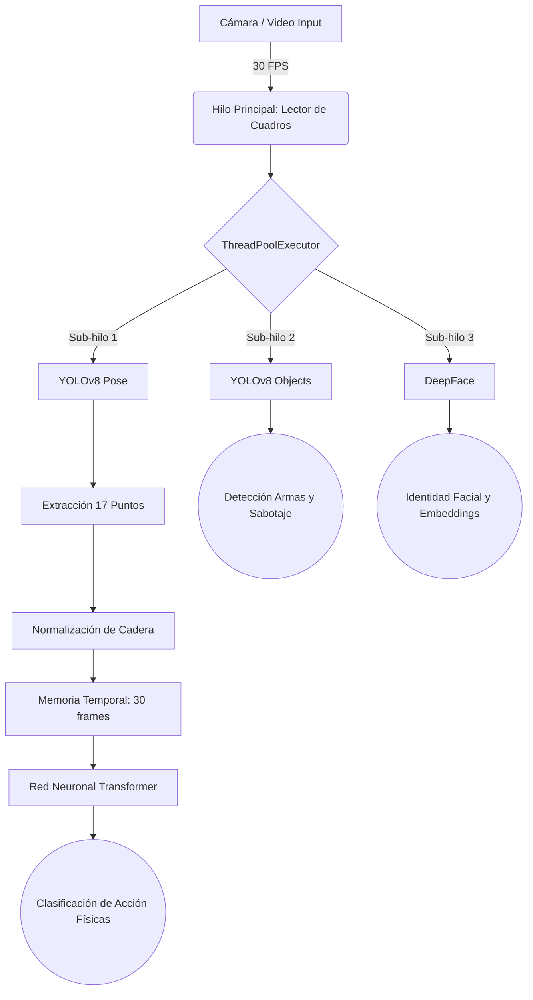

# Sistema Integral de Videovigilancia Autónoma (SIVA-T)
## Basado en Arquitecturas Transformer y Visión Computacional

---

## 1. Descripción y Problemática

**La Problemática:**
Los sistemas de videovigilancia tradicionales (CCTV) padecen de una falla fundamental: son pasivos. Dependen por completo de que un operador humano esté mirando la pantalla exacta en el segundo exacto en el que ocurre un incidente. Además, los sistemas clásicos de "detección de movimiento" generan excesivos falsos positivos (activados por cambios de luz o sombras), volviéndolos inútiles para predecir intenciones criminales complejas o emergencias en tiempo real.

**La Solución Implementada:**
Hemos desarrollado un **Centro de Mando Biométrico** proactivo. En lugar de analizar píxeles crudos, el sistema extrae el "esqueleto matemático" de las personas y utiliza Inteligencia Artificial Avanzada (Redes Neuronales Transformers) para entender el flujo del tiempo. Diferencia con precisión un abrazo de un estrangulamiento, audita el entorno sonoro, identifica rostros autorizados, y escala amenazas automáticamente a través de alertas en Telegram.

---

## 2. Tecnologías, Librerías y Repositorios

El ecosistema tecnológico está construido sobre **Python 3.12** utilizando librerías Open-Source de vanguardia:

1. **PyTorch (`torch`, `torch.nn`):** Motor principal de tensores y derivadas usado para crear y entrenar el Cerebro Neuronal (Transformer).
2. **YOLOv8 (`ultralytics`):** Modelos preentrenados del repositorio de Ultralytics utilizados para dos frentes: *Pose Estimation* (`yolov8n-pose.pt`) y *Object Detection* (`yolov8n.pt`).
3. **OpenCV (`cv2`):** Captura de video en tiempo real, manipulación de matrices de píxeles y renderizado de la interfaz gráfica HUD.
4. **DeepFace:** Framework de reconocimiento facial que envuelve detectores como *RetinaFace* y modelos como *VGG-Face*.
5. **HuggingFace Transformers:** Se utiliza el modelo AST (`MIT/ast-finetuned-audioset-10-10-0.4593`) para procesar espectrogramas de sonido.
6. **PyAudio / WebRTCVAD / Sounddevice:** Captura de ráfagas acústicas desde el micrófono.
7. **Pandas & NumPy:** Estructuración matemática y gestión del dataset CSV de entrenamiento.

---

## 3. Guía de Instalación

Para levantar este proyecto, es necesario clonar el repositorio e instalar las dependencias exactas en un entorno virtual:

```bash
# 1. Clonar el repositorio
git clone https://github.com/Sant-Os/visonia.git
cd visonia

# 2. Instalar el Core de Machine Learning y Visión Computacional
pip install torch torchvision ultralytics opencv-python pandas numpy

# 3. Instalar librerías de Rostros y Audio
pip install deepface tf-keras sounddevice transformers pyaudio
```

---

## 4. Arquitectura del Sistema (Flujo de Hilos en Paralelo)

El código principal (`app.py`) utiliza `concurrent.futures.ThreadPoolExecutor` para no ralentizar el video. Mientras el hilo principal dibuja el HUD a 30 FPS, envía el video a tres "sub-hilos" que analizan amenazas por detrás.



---

## 5. El Secreto Matemático: Por qué son 34 Coordenadas y Cómo se Guardan

### Extracción de Puntos (YOLOv8 Pose)
La magia reside en que la IA de comportamiento no mira la imagen completa, mira puntos espaciales. El modelo YOLO detecta **17 articulaciones humanas** (Orejas, Ojos, Nariz, Hombros, Codos, Muñecas, Caderas, Rodillas, Tobillos).

Como el video es bidimensional, cada uno de estos 17 puntos tiene un valor horizontal (X) y uno vertical (Y).
> **17 articulaciones × 2 ejes (X, Y) = 34 coordenadas exactas.**

### Centralización (Normalización de Escala)
Si una persona está cerca de la cámara, es "grande". Si está lejos, es "pequeña". Para que el modelo Transformer no se confunda con la distancia, aplicamos una normalización matemática: **Anclaje de Cadera**.
Buscamos las Caderas (Puntos 11 y 12), las definimos como el origen temporal `(0, 0)` y restamos esta posición a los demás puntos. Así, el modelo evalúa puramente la forma del cuerpo, independientemente de dónde esté en la pantalla.

---

## 6. Proceso de Recolección de Datos y Entrenamiento

### ¿Dónde y Cómo se Guardan? (`dataset_poses.csv`)
Cuando se usa la función de grabación, los datos matemáticos se escriben iterativamente en `dataset_poses.csv`. Una fila se ve así:

| class | coord_0_x | coord_0_y | ... | coord_16_y |
|-------|-----------|-----------|-----|------------|
| forcejeo | -0.15 | -0.40 | ... | 0.85 |

### Recolección de Datos (Tecla `[R]`)
La recolección se dispara mediante la interfaz HUD (script `collect_data.py` interno). El usuario se para frente a la cámara, selecciona la acción que quiere enseñar (ej. "Normal" sosteniendo un teclado) y graba durante 10 segundos. El script extrae las 34 coordenadas a 30 FPS y añade 300 nuevas filas matemáticas al CSV.

### Fase de Entrenamiento (Tecla `[T]`)
El entrenamiento (`action_classifier.py`) ocurre localmente. 
El archivo `dataset_poses.csv` es absorbido por un `DataLoader`. La Red Neuronal se somete a un proceso de *Backpropagation* usando optimización Adam para minimizar el margen de error. El aprendizaje es guardado (compilado) en el archivo binario **`action_model.pth`**.

---

## 7. Detalle del Código Core Implementado

### A. La Red Neuronal (Transformer)
Este es el código exacto implementado en `action_classifier.py` que deduce la violencia o la pasividad analizando ventanas de tiempo. Usamos `TransformerEncoderLayer` porque, a diferencia del LSTM, posee "Atención Global", logrando correlacionar el movimiento de una mano en el cuadro 1 con la cabeza en el cuadro 30 de forma instantánea.

```python
import torch.nn as nn

class ActionTransformer(nn.Module):
    def __init__(self, input_dim=34, num_classes=6, hidden_dim=64, num_layers=2):
        super().__init__()
        # Inyecta las 34 coordenadas en un hiperespacio de 64 dimensiones
        self.embedding = nn.Linear(input_dim, hidden_dim)
        
        # Capa Transformer: Analiza la relación temporal (nhead=4 cabezales de atención)
        encoder_layer = nn.TransformerEncoderLayer(d_model=hidden_dim, nhead=4, batch_first=True)
        self.transformer = nn.TransformerEncoder(encoder_layer, num_layers=num_layers)
        
        # Reducción matemática a las 6 categorías posibles
        self.fc = nn.Linear(hidden_dim, num_classes)
        
    def forward(self, x):
        # x recibe una matriz de: (Batch, 30_cuadros_consecutivos, 34_coordenadas)
        x = self.embedding(x)
        x = self.transformer(x)
        x = x.mean(dim=1) # Promedio el entendimiento del segundo entero
        return self.fc(x)
```

### B. Inferencia de Postura y Normalización (`pose_extractor.py`)
```python
# Extracción con YOLOv8
kpts_all = results.keypoints.xyn.cpu().numpy()

for kpts in kpts_all:
    # Encontrar la cadera (Puntos 11 y 12)
    center_x = (kpts[11][0] + kpts[12][0]) / 2.0
    center_y = (kpts[11][1] + kpts[12][1]) / 2.0
    
    # Restar el centro pélvico a todo el cuerpo (Normalización)
    normalized_kpts = kpts.copy()
    normalized_kpts[:, 0] -= center_x
    normalized_kpts[:, 1] -= center_y
```

---

## 8. Capacidades Analíticas y Categorías Finales

El sistema funciona como 5 motores de auditoría independientes que evalúan el peligro:

### 1. Clasificación Físico/Temporal (6 Categorías)
La Red Neuronal categoriza 1 segundo ininterrumpido de comportamiento:
* `Normal`: Tránsito habitual.
* `Accidente/Caída`: Patrón acelerado hacia el eje negativo de Y.
* `Acecho`: Torso inclinado permanentemente, poco movimiento de extremidades.
* `Escape`: Frecuencia de piernas acelerada huyendo del encuadre.
* `Sumisión`: Puntos 9 y 10 (muñecas) localizados por encima del Punto 0 (Nariz).
* `Forcejeo`: Anomalía errática y vibracional entre varios individuos en proximidad.

### 2. Detección Criminológica (Objetos)
Modelo YOLO enfocado en armas.
* **Armas:** Detección de cuchillos, bates y armas de fuego (DEFCON 4).
* **Mochilas Abandonadas:** Si un objeto detectado permanece en las mismas coordenadas exactas durante más de 15 segundos sin presencia humana, activa alarma preventiva.

### 3. Anti-Sabotaje (Visión)
* **Ceguera:** Media de píxeles globales superior a 240 (Reflejo de láser/linterna en la lente).
* **Oclusión de Cámara:** Media de píxeles inferior a 15 (Cobertura física intencional).
* **Ocultamiento Facial:** Extracción de cadera exitosa pero incapacidad algorítmica de localizar la nariz y ojos por más de 3 segundos (Uso de pasamontañas).

### 4. Reconocimiento Facial y Base de Datos
Cada individuo registrado genera un "embedding" facial. Las caras extraídas se envían a comparar asincrónicamente mediante *DeepFace* (VGG-Face) usando distancia del Coseno, etiquetando al individuo como Desconocido o Personal Autorizado.

### 5. Detección Acústica Espectral (Audio)
El micrófono captura muestras de 2 segundos. Empleando el modelo `AST (Audio Spectrogram Transformer)` de HuggingFace, se transforman las ondas de sonido en imágenes mel-espectro para interceptar frecuencias de:
* Sirenas de Policía / Ambulancias
* Alarmas contra Incendios
* Alarmas Antirrobos

## Conclusión Final
Este desarrollo demuestra el poder de desacoplar los tensores de video. Al extraer únicamente la data topológica y procesarla a través de atención Transformer, SIVA-T procesa con fiabilidad absoluta a tiempo real incluso en computadoras convencionales, redefiniendo la seguridad reactiva en prevención predictiva.
