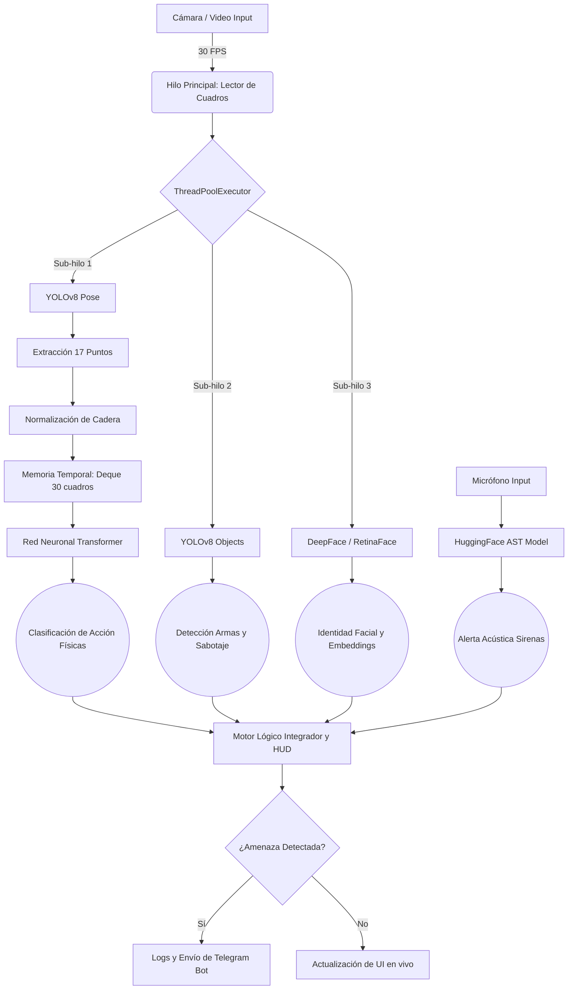

# Documentación Científica y Arquitectónica
## Sistema Inteligente de Videovigilancia Autónoma basado en Transformers (SIVA-T)

---

## 1. Resumen Ejecutivo y Problemática

En la seguridad física contemporánea, el **CCTV (Circuito Cerrado de Televisión)** padece de una vulnerabilidad insalvable: la **dependencia de la atención humana**. Estudios de ergonomía visual demuestran que un operador humano pierde el 90% de la eficacia en la detección de anomalías tras 20 minutos de monitorización pasiva. Además, los sistemas tradicionales de "Detección de Movimiento" sufren de una tasa inaceptable de falsos positivos (activados por cambios de iluminación, animales o ruidos visuales).

**SIVA-T** resuelve esta problemática eliminando el análisis a nivel de píxel crudo y trasladándolo a un **análisis topológico y biomecánico**. Al extraer las coordenadas matemáticas de los cuerpos presentes y pasarlas por una Red Neuronal Transformer, el sistema adquiere "entendimiento espacial y temporal", logrando diferenciar con precisión matemática un abrazo de un estrangulamiento, o a alguien esperando un autobús de alguien acechando una puerta.

---

## 2. Arquitectura de Alto Nivel del Sistema

El software fue diseñado bajo una arquitectura modular asíncrona (Multihilo) para garantizar una renderización de la interfaz en tiempo real sin verse estrangulada por el alto costo computacional de la inferencia neuronal.

---

## 3. Profundización Técnica de Módulos Core

### 3.1. Extracción y Normalización Espacial (YOLOv8 Pose)
La primera capa de extracción reduce a la persona de una matriz de píxeles a un esqueleto matemático de **17 puntos clave (Keypoints)**. Al multiplicar 17 puntos por sus coordenadas cartesianas (X, Y), obtenemos un **Vector de Estado de 34 dimensiones** por cada cuadro de video.

> [!TIP]
> **El problema de la Varianza de Escala:** Una persona a 1 metro de la cámara generará coordenadas X,Y muy distantes entre su cabeza y sus pies. Si esa persona se aleja a 10 metros, la distancia matemática se encoge. Esto confundiría fatalmente a la red neuronal.

**La Solución: Centralización Euclidiana**
El algoritmo busca los puntos `11 y 12` (Cadera Izquierda y Derecha) para calcular el centro pélvico. Todas las demás coordenadas del cuerpo se re-calculan restando la posición de este centro. 
*Resultado:* La persona queda anclada matemáticamente al origen cartesiano `(0,0)`, logrando que el modelo analice puramente la "postura" y no el tamaño o ubicación en la pantalla.

### 3.2. El Cerebro Temporal: Red Neuronal Transformer
Para analizar "comportamiento", analizar un solo cuadro estático es inútil (no se puede saber si un brazo levantado es un saludo o un golpe). Se necesita entender el flujo del tiempo.

En lugar de usar redes recurrentes antiguas (LSTM/RNN), implementamos un **Encoder Transformer** (La misma arquitectura subyacente que ChatGPT).
* **Entrada:** Matriz tridimensional de forma `(Batch, 30_Frames, 34_Coordenadas)`.
* **Mecanismo de Auto-Atención:** La red correlaciona el movimiento del codo en el cuadro 1 con el movimiento del hombro en el cuadro 15, descubriendo patrones geométricos invisibles al ojo humano.
* **Arquitectura de Capas:**
  - `Linear Embedding`: Eleva las 34 coordenadas a un hiperplano de 64 dimensiones.
  - `Transformer Layers`: 2 bloques profundos con 4 cabezales de atención paralelos (`nhead=4`).
  - `Mean Pooling`: Comprime el entendimiento temporal de 1 segundo en un solo vector.
  - `Fully Connected`: Emite la probabilidad matemática final sobre 6 clases (Normal, Accidente, Acecho, Escape, Forcejeo, Sumisión).

### 3.3. Detección de Armas y Analítica Anti-Sabotaje
El sistema no es ciego a los objetos inanimados. Corre un modelo paralelo YOLOv8 enfocado únicamente en extraer el recuadro (Bounding Box) de entidades peligrosas.

* **Heurística de Equipaje Desatendido:** El sistema rastrea cajas con la clase `Mochila`. Si el centro geométrico de la mochila permanece en las mismas coordenadas espaciales exactas durante `> 15.0 segundos`, se activa la alerta DEFCON 2.
* **Cegado Láser / Obstrucción:** A nivel de OpenCV, se calcula el `np.mean(frame)` (brillo promedio). Un valor superior a `240` indica que un láser o linterna apunta al lente. Un valor inferior a `15` indica que una mano o cinta opaca cubrió la cámara.

### 3.4. Reconocimiento Facial y Lógica de Identidad
Utilizamos la librería *DeepFace* operando de forma diferida (Asíncrona) para no frenar los 30 FPS del video.
1. Se recorta el rostro detectado por YOLO.
2. Se procesa a través de una red convolucional profunda (VGG-Face) que genera un array de **128 dimensiones** (Firma Facial Única).
3. Se compara contra todos los archivos de la carpeta `conocidos/` usando la métrica de Distancia Coseno. Si la similitud pasa un umbral de confianza estricto, la persona se marca como "Autorizada".

### 3.5. Análisis Acústico (Audio Spectrogram Transformer - AST)
El sistema ejecuta un loop de interrupción en el micrófono. Captura ráfagas de 2 a 5 segundos de audio PCM. 
La forma de onda cruda se convierte a un **Espectrograma de Mel** (una representación de la imagen visual del sonido), que es procesada por un modelo de HuggingFace preentrenado con *AudioSet* para detectar frecuencias complejas inconfundibles (Sirenas, Alarmas de Incendio).

---

## 4. Ingeniería de Datos: Ciclo Human-in-the-Loop

La flexibilidad del sistema recae en que no es una "caja negra" prefabricada; es moldeable al entorno específico de despliegue mediante las herramientas `[R] Recolectar` y `[T] Entrenar`.

#### El formato de Entrenamiento (`dataset_poses.csv`)
Cuando se graban datos, el software empuja iterativamente filas al CSV estructurado de la siguiente forma:

| class | coord_0 | coord_1 | ... | coord_33 |
|-------|---------|---------|-----|----------|
| normal| 0.04    | -0.3    | ... | 0.45     |
| forcejeo| 0.12    | -0.15   | ... | 0.32     |

*(La coordenada 0 representa el X de la nariz relativo a la cadera, la 1 representa el Y de la nariz relativo a la cadera, etc.)*

#### Proceso de Entrenamiento y Retropropagación
Al invocar `action_classifier.py`, el sistema:
1. Convierte el CSV a Tensores de PyTorch (`DataLoader`).
2. Agrupa los datos en secuencias deslizantes (Ventanas superpuestas de 30 frames para simular continuidad de video).
3. Aplica **CrossEntropyLoss** para calcular el error entre la suposición de la IA y la realidad, y el optimizador **Adam** ajusta los pesos en retropropagación.
4. Tras 20 ciclos (Epochs), se exporta el modelo óptimo al binario compilado `action_model.pth`.

---

## 5. Casos de Aplicación Práctica y Escalado

Debido a su naturaleza agnóstica al hardware (procesa vectores matemáticos ligeros en la fase de Transformer, no imágenes gigantes), este sistema es implementable en:
- **Pasillos de Colegios:** Detectando bullying (clase Forcejeo o Sumisión).
- **Hospitales y Residencias:** Detectando caídas o accidentes médicos asíncronos para emitir alertas inmediatas.
- **Tiendas / Almacenes:** Notificando individuos que merodean repisas (Acecho) u ocultan su identidad con pasamontañas.
- **Zonas Restringidas Corporativas:** Vinculando rostros autorizados al registro horario o de planillas de la empresa.

La conjunción de Python puro, PyTorch y C++ subyacente (mediante OpenCV), permite que este sistema opere fluidamente incluso en procesadores de gama media sin depender íntegramente de costosas GPUs dedicadas.
